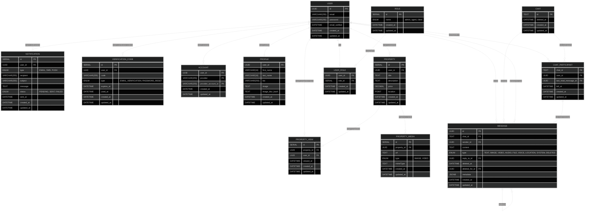

# Logical Data Model

The following LDM(s) represents the current state of the database.

```mermaid
%%{init: {'theme':'dark'}}%%
erDiagram

USER ||--o{ NOTIFICATION : "User's notifications"
USER ||--o{ VERIFICATION_CODE : "User's verification code(s)"
USER ||--o{ ACCOUNT : "User's account"
USER ||--|| PROFILE : "User's profile"
USER ||--o{ PROPERTY : "User's properties"

USER ||--o{ USER_ROLE : "has"
ROLE ||--o{ USER_ROLE : "assigned to"

USER ||--o{ PROPERTY_VIEW : "User's properties views"
PROPERTY ||--o| PROPERTY_VIEW : "User's properties"

PROPERTY ||--o{ PROPERTY_MEDIA : "Property's media"

USER ||--o{ CHAT_PARTICIPANT : "participates in"
CHAT ||--o{ CHAT_PARTICIPANT : "has participants"
USER ||--o{ MESSAGE : "sends"
CHAT ||--o{ MESSAGE : "contains"
MESSAGE ||--o{ MESSAGE : "replies to"
USER ||--o{ MESSAGE : "deleted for user"
CHAT_PARTICIPANT ||--o| MESSAGE : "last read message"

USER {
    UUID id PK
    VARCHAR(255) email
    VARCHAR(255) password
    DATETIME email_verified
    DATETIME created_at
    DATETIME updated_at
}

NOTIFICATION {
    SERIAL id PK
    UUID user_id FK
    ENUM type "EMAIL, SMS, PUSH"
    VARCHAR(255) recipient
    VARCHAR(255) subject
    TEXT message
    ENUM status "PENDING, SENT, FAILED"
    DATETIME sent_at
    DATETIME created_at
    DATETIME updated_at
}

VERIFICATION_CODE {
    SERIAL id PK
    UUID user_id FK
    VARCHAR(255) code
    ENUM type "EMAIL_VERIFICATION, PASSWORD_RESET"
    DATETIME expires_at
    DATETIME used_at
    DATETIME created_at
    DATETIME updated_at
}

ACCOUNT {
    UUID user_id FK
    VARCHAR(255) provider PK
    VARCHAR(255) provider_account_id PK
    DATETIME created_at
    DATETIME updated_at
}

PROFILE {
    UUID user_id FK
    VARCHAR(16) first_name
    VARCHAR(16) last_name
    VARCHAR(255) bio
    TEXT image
    TEXT image_blur_bash
    DATETIME created_at
    DATETIME updated_at
}

ROLE {
    SERIAL id PK
    ENUM name "admin, agent, client"
    DATETIME created_at
    DATETIME updated_at
}

USER_ROLE {
    UUID user_id FK
    SERIAL role_id FK
    DATETIME created_at
    DATETIME updated_at
}

PROPERTY {
    SERIAL id PK
    UUID user_id FK
    TEXT title
    TEXT description
    DECIMAL price
    POINT location
    DATETIME created_at
    DATETIME updated_at
}

PROPERTY_VIEW {
    SERIAL id PK
    UUID property_id FK
    UUID user_id FK
    DATETIME viewed_at
    DATETIME created_at
    DATETIME updated_at
}

PROPERTY_MEDIA {
    SERIAL id PK
    UUID property_id FK
    TEXT url
    ENUM type "IMAGE, VIDEO"
    TEXT mimeType
    DATETIME created_at
    DATETIME updated_at
}

CHAT {
    TEXT id PK
    DATETIME deleted_at
    DATETIME created_at
    DATETIME updated_at
}

CHAT_PARTICIPANT {
    TEXT chat_id FK
    UUID user_id FK
    UUID last_read_message_id FK
    DATETIME left_at
    DATETIME created_at
    DATETIME updated_at
}

MESSAGE {
    UUID id PK
    TEXT chat_id FK
    UUID sender_id FK
    TEXT content
    ENUM type "TEXT, IMAGE, VIDEO, AUDIO, FILE, VOICE, LOCATION, SYSTEM, DELETED"
    UUID reply_to_id FK
    DATETIME deleted_at
    UUID deleted_for_id FK
    JSONB metadata
    DATETIME created_at
    DATETIME updated_at
}

```
